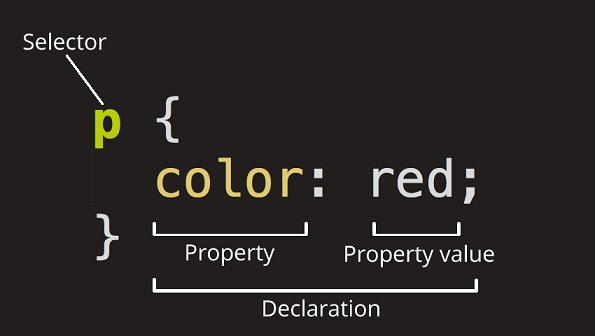

# CSS: Cascading Style Sheets

**Cascading Style Sheets** (**CSS**) is a [stylesheet](https://developer.mozilla.org/en-US/docs/Web/API/StyleSheet) language used to describe the presentation of a document written in [HTML](https://developer.mozilla.org/en-US/docs/Web/HTML) or [XML](https://developer.mozilla.org/en-US/docs/Web/XML/XML_introduction). CSS describes how elements should be rendered on screen, on paper, in speech, or on other media.

### Anatomy of a CSS ruleset

The whole structure is called a **ruleset**. Let's dissect the CSS code for red paragraph text to understand how it works :

### Different types of selectors

| Selector name         | What does it select                                          | Example                                                      |
| :-------------------- | :----------------------------------------------------------- | :----------------------------------------------------------- |
| Element selector      | All HTML elements of the specified type.                     | `p` selects `
`                                            |
| ID selector           | The element on the page with the specified ID. On a given HTML page, each id value should be unique. | `#my-id` selects `
` or `<a id="my-id">`        |
| Class selector        | The element(s) on the page with the specified class. Multiple instances of the same class can appear on a page. | `.my-class` selects `
` and `<a class="my-class">` |
| Attribute selector    | The element(s) on the page with the specified attribute.     | `img[src]` selects `` but not `` |
| Pseudo-class selector | The specified element(s), but only when in the specified state. (For example, when a cursor hovers over a link.) | `a:hover` selects `<a>`, but only when the mouse pointer is hovering over the link. |

