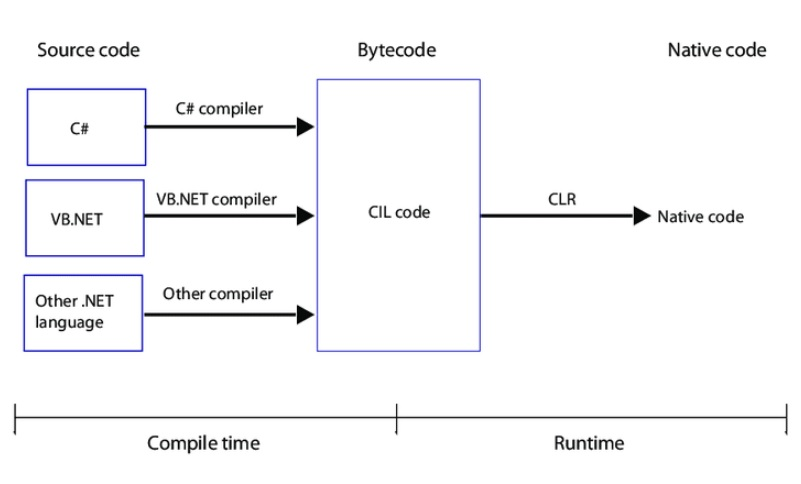

# .NET Questions

## First question

How does the .NET work?

- .NET based applications that are written in supportive languages like C#, F#, or Visual Basic are compiled to Common Intermediate Language (CIL).
- Compiled code is stored in the form of an assembly file that has a .dll or .exe file extension. Compiler also produces metadata that describes the types, members, and references in your code.
- When the .NET application runs, Common Language Runtime (CLR) takes the assembly file and converts the CIL into machine code with the help of the Just In Time (JIT) compiler.
- CLR supplies a JIT compiler for each supported CPU architecture.

## Second question

What is an assembly?

<u>**An assembly**</u> is a file that is automatically generated by the compiler which consists of a collection of types and resources that are built to work together and form a logical unit of functionality. We can also say, assembly is a compiled code and logical unit of code.

Assemblies are implemented in the form of executable (.exe) or dynamic link library (.dll) files.

## Third question

Explain about major components of the .NET

- Common Language Runtime (CLR):

It is an execution engine that runs the code and provides memory management, garbage collection, type safety, exception handling, security, and thread management. It also makes it easier for designing the applications and components whose objects interact across the languages.

- Common Type System (CTS):

CTS specifies a standard that will mention which type of data and value can be defined and managed in memory during runtime.
It will make sure that programming data defined in different languages should interact with each other for sharing the information.

- Common Language Specification (CLS):

Common Language Specification (CLS) is a subset of CTS and defines a set of rules and regulations to be followed by every .NET language.

